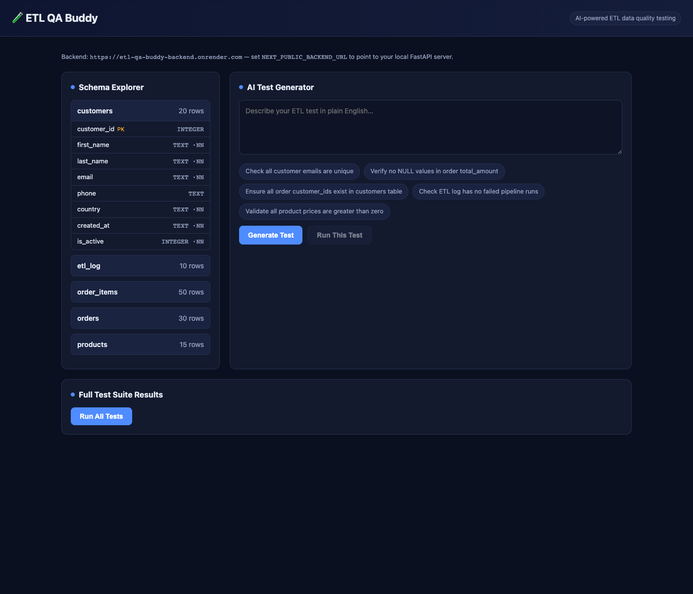
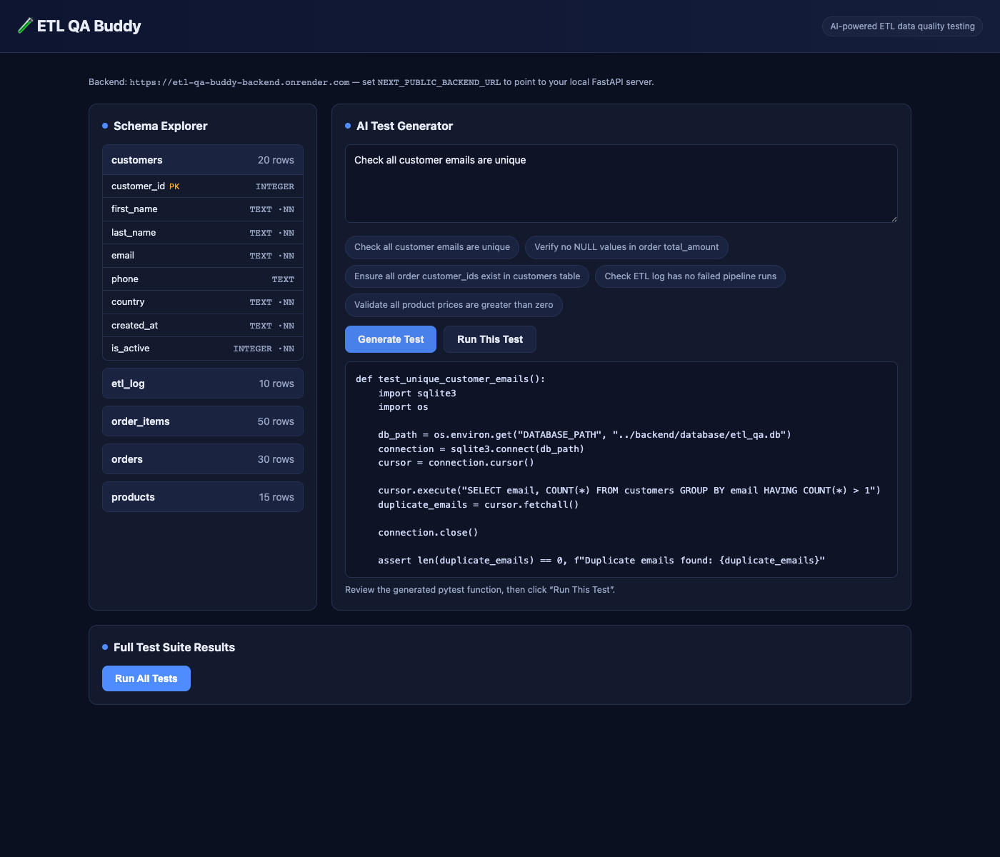
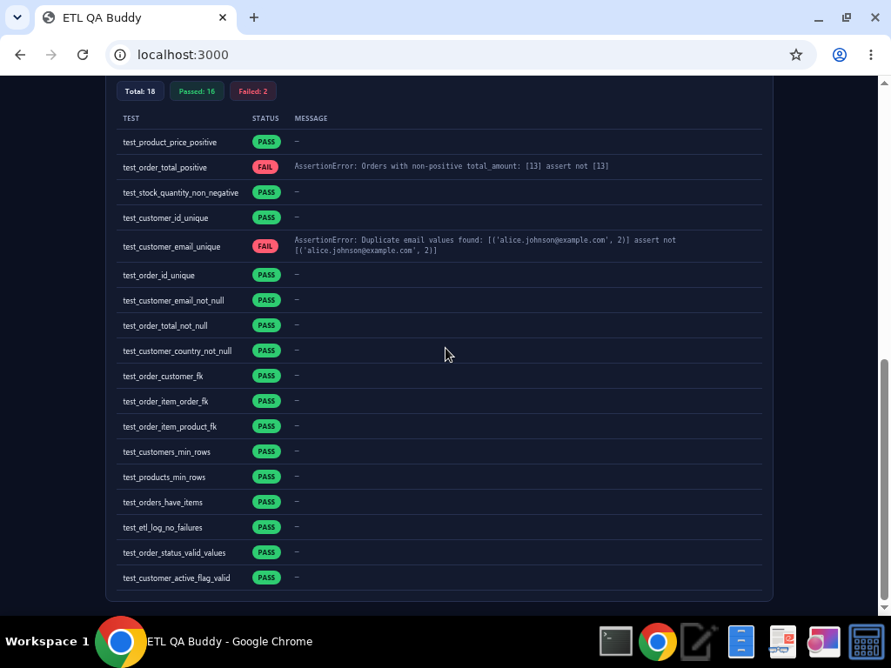

# 🧪 ETL QA Buddy

> **AI-powered ETL data-quality testing dashboard** — describe a data-quality
> check in plain English, let AI generate a runnable `pytest` test, execute it
> against a sample SQLite ETL database, and see PASS/FAIL results instantly.

---

## 📖 Project Title

**ETL QA Buddy** — an AI assistant for ETL / data-warehouse QA engineers.

---

## ❗ Problem Statement

ETL pipelines move millions of rows between systems every day. When data quality
breaks — NULLs in critical columns, duplicate keys, broken foreign-key
relationships, suspicious zero-value transactions, or partially-loaded pipeline
runs — the damage is silent and expensive.

Writing data-quality tests by hand is slow and repetitive:

- Every check (null check, duplicate check, referential integrity, row counts,
  business rules) has to be hand-coded as SQL + assertions.
- QA engineers spend more time writing boilerplate `pytest` than actually
  reasoning about data quality.
- Non-engineers (analysts, product owners) can describe what they want checked
  in plain English but can't turn it into an executable test.

**There is no fast bridge between "what should be true about my data" (English)
and "an executable, repeatable test" (pytest + SQL).**

---

## 💡 Solution

ETL QA Buddy closes that gap:

1. **Describe** a data-quality rule in plain English
   (e.g. *"check that all customer emails are unique"*).
2. **Generate** — the backend calls **OpenAI GPT-4o-mini** to produce a single,
   runnable `pytest` function that queries the database with `sqlite3`.
3. **Run** — the generated test is executed safely against a realistic sample
   SQLite ETL database and returns **PASS/FAIL** with full output.
4. **Regression suite** — a pre-written suite of 18 ETL QA tests
   (null, duplicate, referential-integrity, data-type, row-count and
   transformation checks) can be run with one click.

The sample database ships with **intentional data-quality defects**, so the suite
demonstrates real value out of the box — some tests **fail on purpose** to show
the tool catching genuine issues:

| Injected defect | Test that catches it |
| --- | --- |
| Order `#13` has `total_amount = 0.0` | `test_order_total_positive` ❌ |
| Two customers share `alice.johnson@example.com` | `test_customer_email_unique` ❌ |
| 2 customers with `NULL` phone | (visible in schema / null checks) |
| ETL log run marked `partial` (`rows_extracted != rows_loaded`) | inspectable via `/schema` + transformation checks |

> ✅ If no `OPENAI_API_KEY` is configured, the generator automatically falls back
> to a deterministic template so the app still works end-to-end.

---

## 🏗️ Tech Stack

| Layer | Technology |
| --- | --- |
| **Frontend** | Next.js 14 (App Router) · React 18 · TypeScript · dark-theme CSS — hosted on **Vercel** |
| **Backend** | FastAPI · Uvicorn · Pydantic — hosted on **Render** |
| **AI** | OpenAI `gpt-4o-mini` (with template fallback) |
| **Database** | **SQLite** (zero-setup, file-based — auto-created on boot) |
| **Testing** | pytest · pytest-json-report |
| **Language** | Python 3.10+ · TypeScript |

### Architecture

```
                    ┌───────────────────────────────────────┐
                    │   Next.js Frontend (Vercel)            │
                    │   • Schema Explorer                    │
                    │   • AI Test Generator                  │
                    │   • Full Test Suite Results            │
                    └───────────────┬───────────────────────┘
                                    │  HTTP (NEXT_PUBLIC_BACKEND_URL)
                                    ▼
                    ┌───────────────────────────────────────┐
                    │   FastAPI Backend (Render)             │
                    │   GET  /health                         │
                    │   GET  /schema                         │
                    │   POST /generate-test  ── OpenAI ──►   │
                    │   POST /run-test       ── pytest ──►   │
                    │   GET  /run-all-tests  ── pytest ──►   │
                    └───────────────┬───────────────────────┘
                                    │  sqlite3
                                    ▼
                    ┌───────────────────────────────────────┐
                    │   SQLite DB  (backend/database/…)      │
                    │   customers · products · orders        │
                    │   order_items · etl_log                │
                    └───────────────────────────────────────┘
                                    ▲
                    ┌───────────────┴───────────────────────┐
                    │   tests/  (pre-written pytest suite)   │
                    └───────────────────────────────────────┘
```

---

## 🚀 How to Run

### Prerequisites
- Python **3.10+** and `pip`
- Node.js **18+** and `npm`

### 1. Backend + Database (local)

> The deployed backend auto-creates the SQLite DB on first boot, so the
> `setup_db.py` step below is only needed for local development.

```bash
cd backend

# (recommended) create a virtual environment
python -m venv venv
source venv/bin/activate          # Windows: venv\Scripts\activate

# install dependencies (no Docker needed)
pip install -r requirements.txt

# configure environment
cp .env.example .env
#   → edit .env and add your OPENAI_API_KEY (optional; falls back to template)

# create and populate the SQLite database (optional — auto-created on boot)
python database/setup_db.py

# start the API on http://localhost:8000
uvicorn main:app --reload --port 8000
```

Quick smoke test:

```bash
curl http://localhost:8000/health
curl http://localhost:8000/schema
```

### 2. Run the test suite from the CLI

```bash
# from the project root
pytest tests/ -v
# Expected: 16 passed, 2 failed  (the 2 failures are intentional demo defects)
```

### 3. Frontend (local dev)

```bash
cd frontend
npm install
cp .env.example .env.local        # NEXT_PUBLIC_BACKEND_URL=http://localhost:8000
npm run dev
# open http://localhost:3000
```

---

## 🌐 Live Demo

Both the frontend and backend are deployed:

| Layer | URL |
| --- | --- |
| **Frontend (Vercel)** | **https://etl-qa-buddy.vercel.app** |
| **Backend API (Render)** | **https://etl-qa-buddy-backend.onrender.com** |
| Backend health check | `https://etl-qa-buddy-backend.onrender.com/health` |

The frontend's `NEXT_PUBLIC_BACKEND_URL` is set to the Render backend, so the
deployed app can run the full test suite end-to-end — no local server needed.

### Deploy the frontend to Vercel

1. Push this repository to GitHub (repo name: **`ETL_QA_Buddy`**).
2. Go to **[vercel.com](https://vercel.com) → New Project → Import** your repo.
3. Vercel auto-detects Next.js. The included `vercel.json` sets:
   - Install: `cd frontend && npm install`
   - Build: `cd frontend && npm run build`
   - Output: `frontend/.next`
4. Add an environment variable in the Vercel dashboard:
   - `NEXT_PUBLIC_BACKEND_URL` = `https://etl-qa-buddy-backend.onrender.com`
5. Click **Deploy**. Your UI goes live at `https://etl-qa-buddy.vercel.app`.

### Deploy the backend to Render

1. The repo includes `render.yaml` (a Render Blueprint) at the repo root.
2. Push to GitHub, then in Render: **New → Blueprint** and select the repo.
3. Render provisions the web service automatically from `render.yaml`.
4. The backend auto-creates and seeds the SQLite DB on first boot, so no
   manual setup is required.
5. Optional: add `OPENAI_API_KEY` as an env var in the Render dashboard to
   enable real AI test generation (falls back to a deterministic template if
   unset).

> The backend runs on Render's free tier, which spins down after ~15 minutes
> of inactivity — the first request after idle will be slow (cold start).

---

## 🖥️ How to Use the AI Test Generator

1. Open the dashboard — the **Schema Explorer** (left) auto-loads all 5 tables
   and row counts from `GET /schema`.
2. In **AI Test Generator** (center), type a plain-English rule or click an
   example chip.
3. Click **Generate Test** → GPT-4o-mini returns a runnable `pytest` function,
   shown in a code block.
4. Click **Run This Test** → the test executes against the SQLite DB and shows
   **PASS/FAIL** with output.
5. Click **Run All Tests** (bottom) → the full pre-written suite runs and results
   appear as a PASS/FAIL table with a summary (Total / Passed / Failed).

> Generated tests connect to the DB via the `DATABASE_PATH` environment
> variable (set by the backend to the absolute SQLite path). The test runner
> also rewrites any legacy hardcoded `../backend/database/etl_qa.db` paths in
> generated code to the absolute path, so "Run This Test" works regardless of
> what the AI model emits.
>
> The generator also injects the **live database schema** (all table and column
> names) into the AI prompt, so GPT-4o-mini writes SQL against the real columns
> (e.g. `unit_price`, `customer_id`) instead of guessing names like `price` or
> `id` — generated tests run correctly the first time.

### Sample test descriptions to try
- `Check all customer emails are unique`  *(will FAIL — soft duplicate injected)*
- `Verify no NULL values in order total_amount`
- `Ensure all order customer_ids exist in customers table`
- `Check ETL log has no failed pipeline runs`
- `Validate all product prices are greater than zero`

---

## 📸 Screenshots

### 1. Dashboard — Schema Explorer + AI Test Generator


### 2. AI-generated pytest test from a plain-English description


### 3. Full test suite results (16 passed, 2 intentional failures)


---

## 🔌 Backend API Reference

| Method | Endpoint | Description |
| --- | --- | --- |
| `GET`  | `/health` | Health check + DB status |
| `GET`  | `/schema` | Returns all tables, columns, types, row counts |
| `POST` | `/generate-test` | `{ "description": "..." }` → `{ "test_code": "..." }` |
| `POST` | `/run-test` | `{ "test_code": "..." }` → `{ "passed", "output", "error" }` |
| `GET`  | `/run-all-tests` | Runs the full `tests/` suite → JSON summary + per-test results |

---

## 🗄️ Sample Database Schema

| Table | Rows | Purpose |
| --- | --- | --- |
| `customers` | 20 | Customer master data |
| `products` | 15 | Product catalog |
| `orders` | 30 | Customer orders |
| `order_items` | 50 | Line items per order |
| `etl_log` | 10 | Simulated ETL pipeline run metadata |

---

## 🧪 Pre-written Test Suite (`tests/`)

| File | Tests |
| --- | --- |
| `test_null_checks.py` | email / total_amount / country NOT NULL |
| `test_duplicate_checks.py` | unique customer_id, email, order_id |
| `test_referential_integrity.py` | order→customer, item→order, item→product FKs |
| `test_data_types.py` | positive prices / totals, non-negative stock |
| `test_row_counts.py` | min customers / products, every order has items |
| `test_transformations.py` | no failed ETL logs, valid statuses, valid flags |

---

## 🔐 Environment Variables Reference

### `backend/.env`
| Variable | Description | Default |
| --- | --- | --- |
| `OPENAI_API_KEY` | OpenAI API key for AI test generation (optional — template fallback if unset) | — |
| `DATABASE_PATH` | Path to the SQLite database file | `./database/etl_qa.db` |

### `frontend/.env.local`
| Variable | Description | Default |
| --- | --- | --- |
| `NEXT_PUBLIC_BACKEND_URL` | URL of the FastAPI backend | `https://etl-qa-buddy-backend.onrender.com` |

> ⚠️ Only `.env.example` files are committed. **Never commit real secrets** —
> `.env` files and the generated `etl_qa.db` are git-ignored.

---

## 📁 Project Structure

```
ETL_QA_Buddy/
├── frontend/                 # Next.js app → Vercel
│   ├── app/                  # App Router (layout, page, globals.css)
│   ├── components/           # TestGenerator, TestResults, SampleSchema
│   └── vercel.json           # Vercel build config (Next.js, .next output)
├── backend/                  # FastAPI backend → Render
│   ├── main.py               # API endpoints (auto-creates SQLite DB on boot)
│   ├── database/setup_db.py  # Creates + populates SQLite DB
│   └── services/             # ai_generator.py, test_runner.py
├── tests/                    # Pre-written pytest ETL QA suite
├── docs/                     # Screenshots
├── vercel.json               # Vercel config (frontend)
├── render.yaml               # Render Blueprint (backend web service)
├── .gitignore
└── README.md
```

---

## 📝 License

MIT — free to use, modify, and share.
